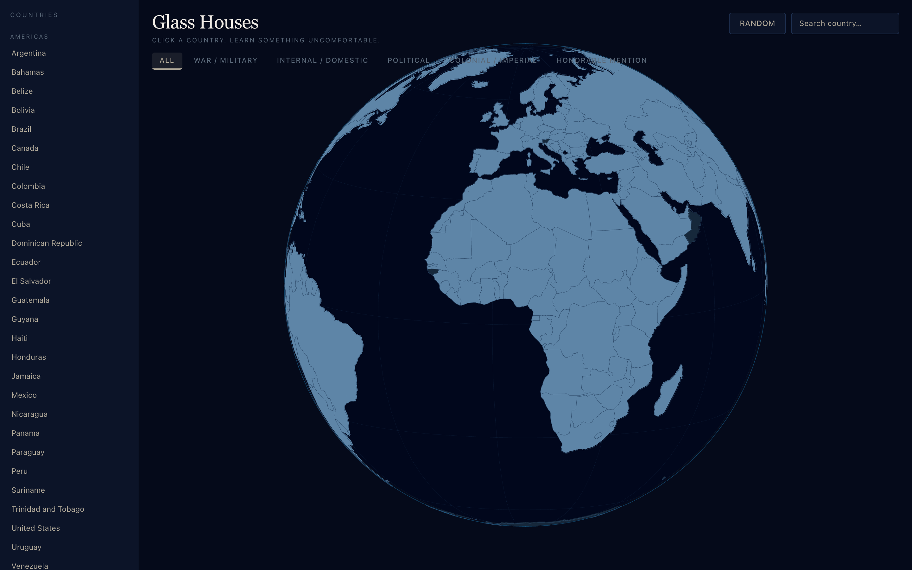
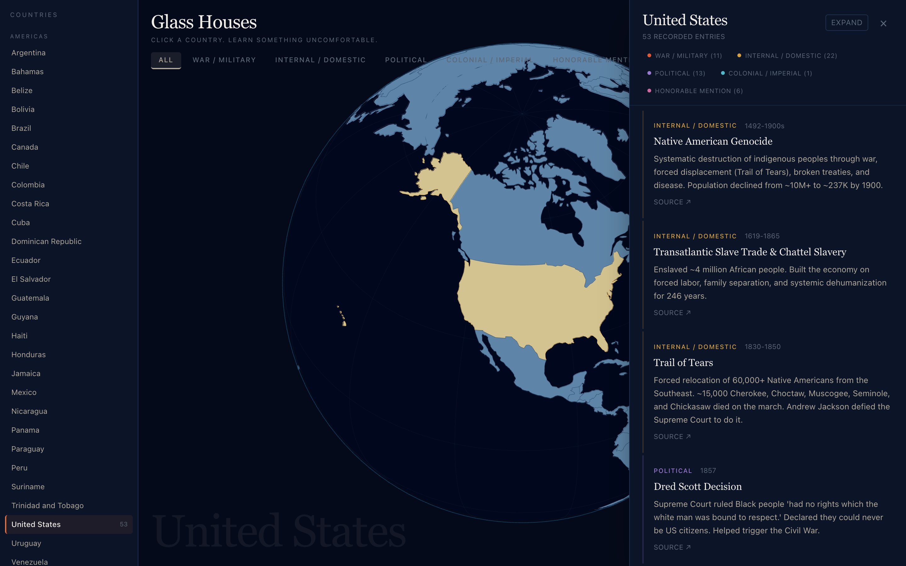
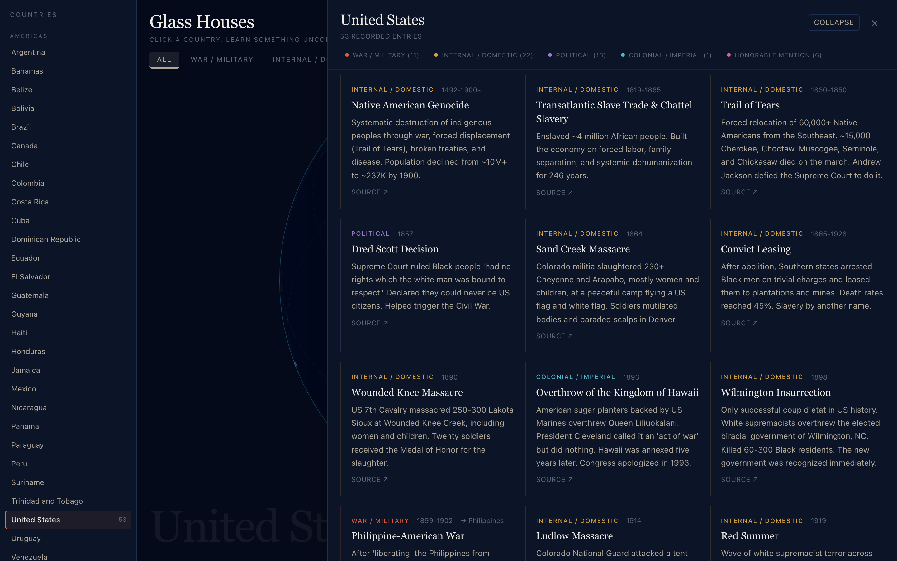
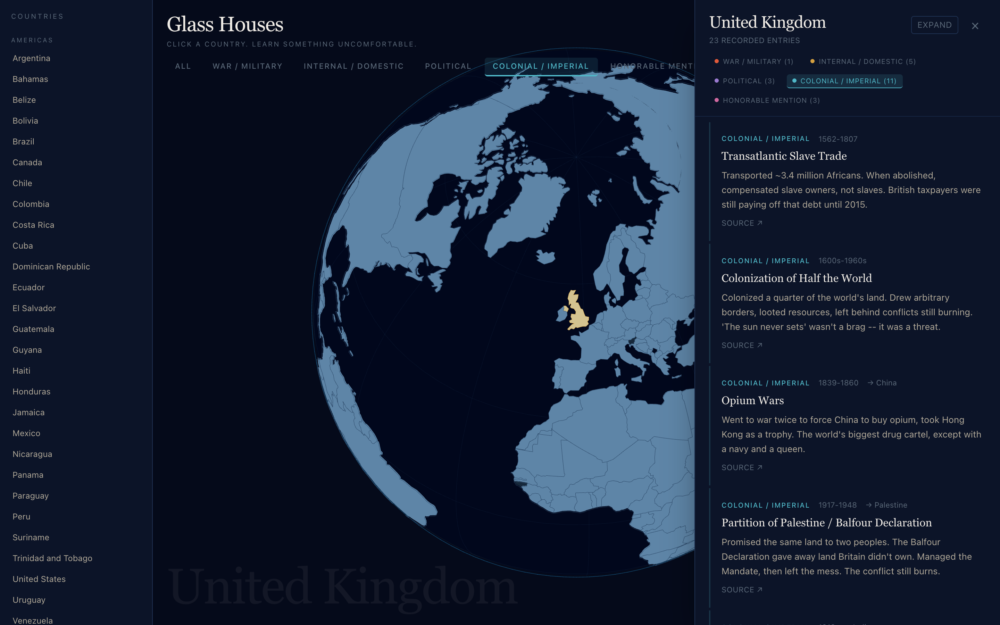
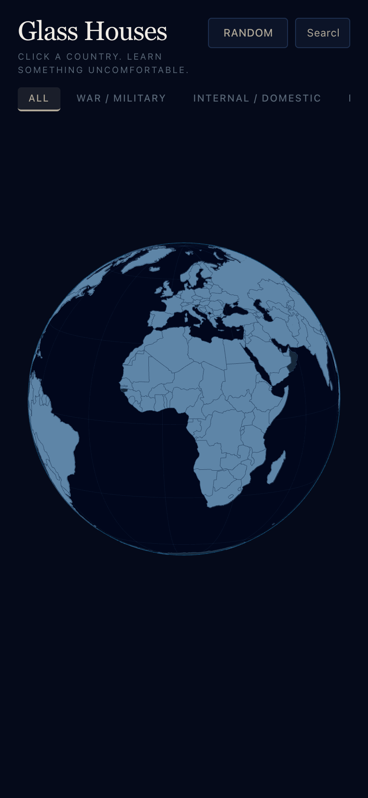

# Glass Houses

**Click a country. Learn something uncomfortable.**

An interactive 3D globe of documented historical atrocities. Spin the Earth, click any
of **169 countries**, and read what that state did — to its own people, to its
neighbours, and to the places it colonised. Every one of the **808 entries** links to a
source.

The name is the argument: people in glass houses shouldn't throw stones. No country in
this dataset comes out clean.



---

## Contents

- [What it does](#what-it-does)
- [Screenshots](#screenshots)
- [Getting started](#getting-started)
- [Project structure](#project-structure)
- [Adding or editing data](#adding-or-editing-data)
- [How the globe works](#how-the-globe-works)
- [About the data](#about-the-data)
- [Known limitations](#known-limitations)
- [Tech stack](#tech-stack)
- [License](#license)

---

## What it does

- **Spin and click.** A WebGL globe built from real country geometry. Countries with
  entries are lit; the rest stay dark. Hover for a name and a count.
- **Five categories.** War / Military, Internal / Domestic, Political, Colonial /
  Imperial, and Honorable Mention — the last for the absurd ones that still killed
  people, like the Great Molasses Flood.
- **Cross-referenced.** Entries done *to* another country are tagged with the target, so
  the Opium Wars show up under the United Kingdom pointing at China.
- **Three ways in.** Click the globe, pick from the region-grouped sidebar, or hit
  **Random** and see where you land.
- **Sourced.** Every entry carries a link out.

## Screenshots

### Country detail

Selecting a country rotates the globe to centre it and opens a chronological panel.
Category counts double as filters. Close it with the `×` or the <kbd>Esc</kbd> key.



### Expanded reading view

**Expand** switches the panel to a multi-column layout for countries with long records.



### Filtering

Click a category chip to narrow the list — here, the United Kingdom's colonial record.



### Mobile



## Getting started

Requires **Node.js 20+** and **pnpm**.

```bash
pnpm install
pnpm dev
```

Open <http://localhost:3000>.

| Script           | What it does                                  |
| ---------------- | --------------------------------------------- |
| `pnpm dev`       | Dev server with Turbopack                     |
| `pnpm build`     | Production build                              |
| `pnpm start`     | Serve the production build                    |
| `pnpm lint`      | ESLint over `src/`                            |
| `pnpm typecheck` | `tsc --noEmit`                                |

The app is fully static — `pnpm build` prerenders it, and it deploys to any static host
or to Vercel with no configuration.

## Project structure

```
src/
├── app/
│   ├── layout.tsx        Metadata, fonts, OpenGraph tags
│   ├── page.tsx          Layout shell and shared UI state
│   └── globals.css       Design tokens (colours, fonts)
├── components/
│   ├── WorldMap.tsx      The globe: geometry, rotation, hit-testing
│   ├── AtrocityPanel.tsx Detail panel, filtering, sorting
│   ├── CountrySidebar.tsx Region-grouped country list
│   ├── CategoryFilter.tsx Top-level category filter
│   └── CountryDropdown.tsx Country picker
├── data/
│   └── atrocities.ts     The entire dataset + country/category metadata
└── site.ts               Name, tagline, canonical URL
```

`src/data/atrocities.ts` is the only file that needs touching to change content.

## Adding or editing data

Countries are keyed by **ISO 3166-1 numeric** code, as strings, because that is what the
[world-atlas](https://github.com/topojson/world-atlas) topology uses. Use the current
code — Sudan is `729`, not the pre-2011 `736`.

**1. Make sure the country exists** in `countries`. Each entry needs a display name and a
region; the region drives the sidebar grouping and is type-checked against the `regions`
list, so a typo fails the build rather than silently dropping the country.

```ts
export const countries: Record<string, Country> = {
  "566": { name: "Nigeria", region: "Africa" },
};
```

**2. Add entries** under the same key in `atrocities`:

```ts
"566": [
  {
    title: "Biafran War Blockade",
    year: "1967-1970",
    category: "war",
    description: "One or two sentences. Concrete numbers where they exist.",
    source: "https://en.wikipedia.org/wiki/Nigerian_Civil_War",
  },
],
```

| Field         | Required | Notes                                                              |
| ------------- | -------- | ------------------------------------------------------------------ |
| `title`       | yes      | Short name of the event                                            |
| `year`        | yes      | `"1972"`, a range `"1967-1970"`, or open-ended `"2014-present"`     |
| `category`    | yes      | `war` · `internal` · `political` · `colonial` · `meme`             |
| `description` | yes      | One or two sentences                                               |
| `target`      | no       | ISO numeric code of the country it was done *to*                   |
| `source`      | no       | URL — in practice every entry has one, please keep it that way     |

Entries are sorted by the leading year automatically, so file order does not matter.

## How the globe works

`WorldMap.tsx` builds real geometry rather than texturing a sphere:

1. Fetch the world-atlas TopoJSON and convert it to GeoJSON features.
2. For each country, triangulate its polygons flat, **tessellate** them, then project
   every vertex onto the sphere — subdividing first is what keeps borders curved instead
   of cutting straight lines through the Earth.
3. Rings that cross the antimeridian are unwrapped so they don't wrap the wrong way
   round the globe.
4. Borders are drawn as separate line segments on a slightly larger radius.

Selecting a country eases the globe's rotation to that country's centroid. Because the
projection is orthographic, the far side of the globe still registers raycast hits, so
pointer events ignore anything behind the camera-facing hemisphere.

## About the data

The dataset is hand-assembled and **editorial**. It makes no claim to be exhaustive,
neutral in tone, or a substitute for scholarship:

- Coverage is uneven. Some countries have fifty entries, others have three. That
  reflects what has been written down and compiled here, not a ranking of guilt.
- Casualty figures are contested for almost every event listed. Where sources disagree
  the entries give ranges.
- Descriptions are written in a plain, sometimes dry register. That is a deliberate
  editorial voice, not an attempt at neutrality.
- **Honorable Mention** is the tongue-in-cheek category. It is still real events.

Every entry links to a source — mostly Wikipedia, which is a starting point for reading,
not an endpoint. Corrections and additions are welcome; so are sources that contradict
what is here.

## Known limitations

- **Territories fold into states.** Greenland is filed under Denmark, Puerto Rico under
  the United States, and so on, via `TERRITORY_PARENTS` in `WorldMap.tsx`.
- **Not everything is clickable.** Kosovo, Northern Cyprus and Somaliland carry no ISO
  numeric id in the atlas, and micro-states (Malta, Singapore, Bahrain, the Maldives,
  Vatican City, Comoros) are too small to appear at 110m resolution. All of them are
  still reachable from the sidebar and the dropdown.
- **The atlas is fetched at runtime** from jsDelivr, so a first paint needs network
  access. The app renders the ocean and UI regardless.

## Tech stack

[Next.js 16](https://nextjs.org) (App Router) · [React 19](https://react.dev) ·
[TypeScript](https://www.typescriptlang.org) ·
[Three.js](https://threejs.org) via
[React Three Fiber](https://docs.pmnd.rs/react-three-fiber) ·
[d3-geo](https://d3js.org/d3-geo) · [TopoJSON](https://github.com/topojson/topojson) ·
[Tailwind CSS 4](https://tailwindcss.com)

## License

[MIT](LICENSE) © Joseph Williams

The code is MIT. The historical events described in the dataset belong to everyone, and
the sources they link to carry their own licences.
